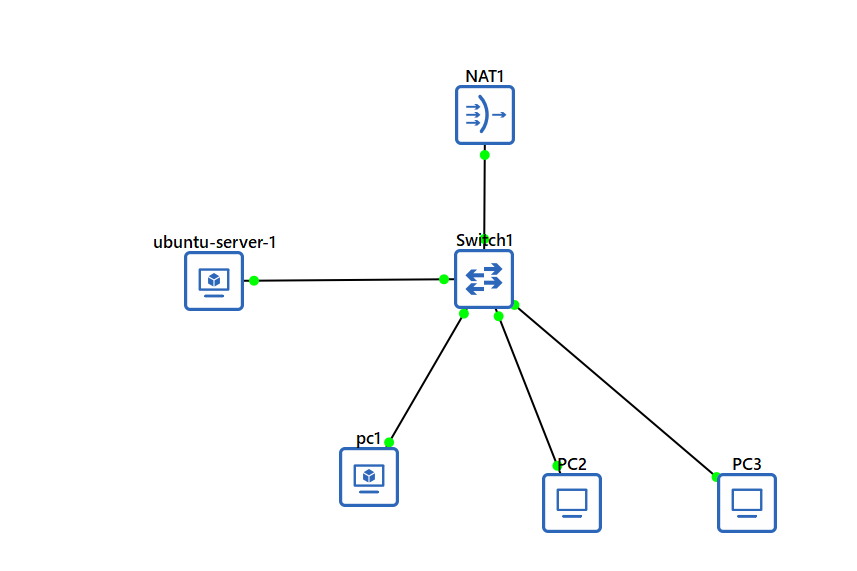
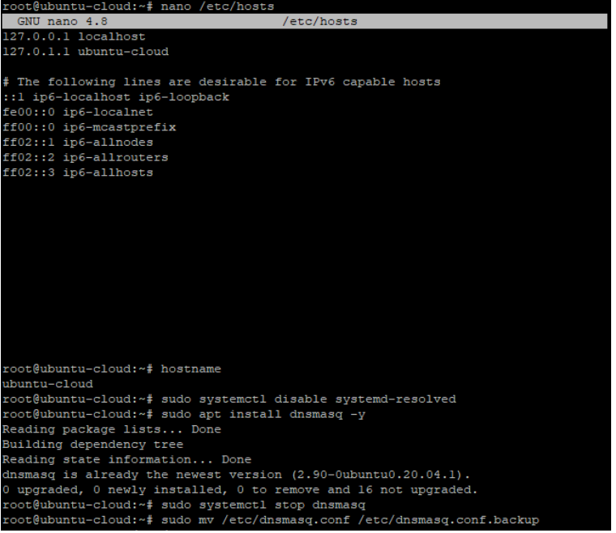
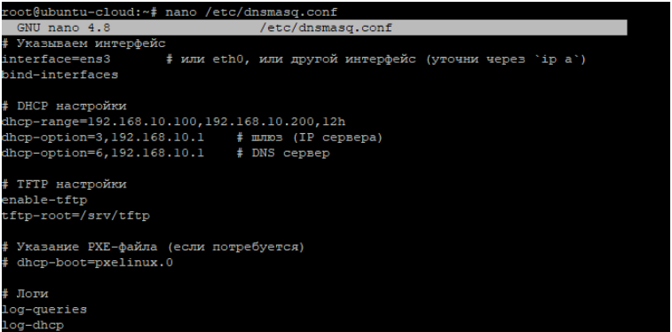
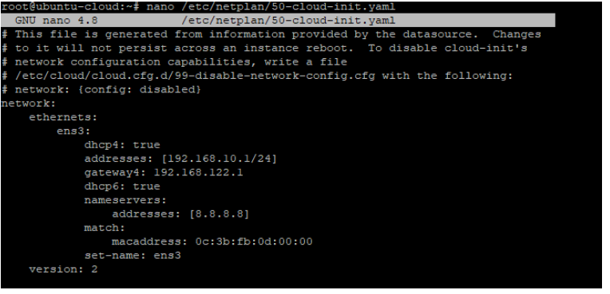
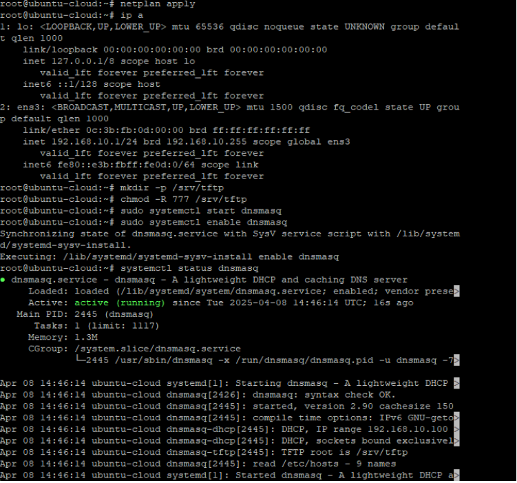
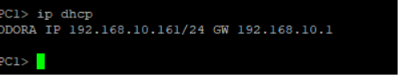
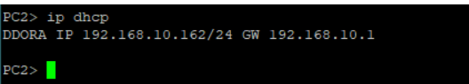
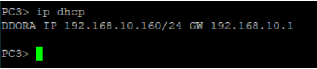

---
## Front matter
title: "Научная практика"
subtitle: "Установка интрнет-соединения с NAT через маршрутизатор...Массовое обслуживание пк машин в дисплейных классах."
author: "Шуваев Сергей Александрович"

## Generic otions
lang: ru-RU
toc-title: "Содержание"

## Bibliography
bibliography: bib/cite.bib
csl: pandoc/csl/gost-r-7-0-5-2008-numeric.csl

## Pdf output format
toc: true # Table of contents
toc-depth: 2
lof: true # List of figures
lot: false # List of tables
fontsize: 12pt
linestretch: 1.5
papersize: a4
documentclass: scrreprt
## I18n polyglossia
polyglossia-lang:
  name: russian
  options:
	- spelling=modern
	- babelshorthands=true
polyglossia-otherlangs:
  name: english
## I18n babel
babel-lang: russian
babel-otherlangs: english
## Fonts
mainfont: PT Serif
romanfont: PT Serif
sansfont: PT Sans
monofont: PT Mono
mainfontoptions: Ligatures=TeX
romanfontoptions: Ligatures=TeX
sansfontoptions: Ligatures=TeX,Scale=MatchLowercase
monofontoptions: Scale=MatchLowercase,Scale=0.9
## Biblatex
biblatex: true
biblio-style: "gost-numeric"
biblatexoptions:
  - parentracker=true
  - backend=biber
  - hyperref=auto
  - language=auto
  - autolang=other*
  - citestyle=gost-numeric
## Pandoc-crossref LaTeX customization
figureTitle: "Рис."
tableTitle: "Таблица"
listingTitle: "Листинг"
lofTitle: "Список иллюстраций"
lotTitle: "Список таблиц"
lolTitle: "Листинги"
## Misc options
indent: true
header-includes:
  - \usepackage{indentfirst}
  - \usepackage{float} # keep figures where there are in the text
  - \floatplacement{figure}{H} # keep figures where there are in the text
---

# Цель работы

Установить соединение с NAT для получения доступа в интернет

# Выполнение работы

Используем образ ubuntu-server из Qemu VM. На нем устанавливаем dnsmasq.
Далее меняем имя хоста на ubuntu-cloud для того, чтобы отключить system-resolved, который занимает 53 порт.

Общая схема сети с тестовыми VPC

{#fig:001 width=70%}

Настраиваю dnmasq.conf

{#fig:002 width=70%}

Дальше добавляю адрес для сервера

{#fig:003 width=70%}

{#fig:004 width=70%}

Подключение папки для tftp и проверка статуса dhcp 

{#fig:005 width=70%} 

После этого я проверил назначение ip адресов для других устройств, подключенным к коммутатору. IP-адреса выдались из обозначенного диапазона.

{#fig:006 width=70%}

{#fig:007 width=70%}

{#fig:008 width=70%}

Примечание:Если к топологии подключен Nat или Cloud, то ip-адреса назначаются из другого диапазона. Пропало подключение к сети и из-за этого не получается скачать tftp, а осталось сделать только это. Сама папка для tftp настроена. 

# Выводы

В результате проделанной работы я настроил dnmasq.conf,добавил адрес для сервера,подключил папки для tftp и проверил статуса dhcp,назначение адресов для других устройств которые подключены к коммутатору.
