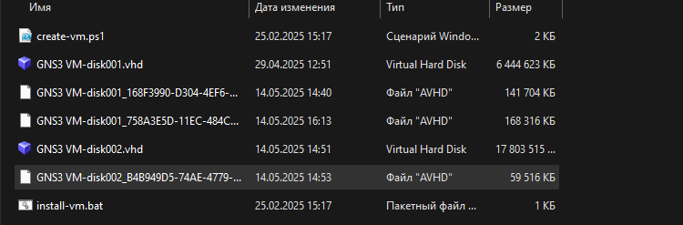

---
## Front matter
title: "Научная практика"
subtitle: "Попытка настроить sali сервере ubuntu"
author: "Хватов Максим Григорьевич"

## Generic otions
lang: ru-RU
toc-title: "Содержание"

## Bibliography
bibliography: bib/cite.bib
csl: pandoc/csl/gost-r-7-0-5-2008-numeric.csl

## Pdf output format
toc: true # Table of contents
toc-depth: 2
lof: true # List of figures
lot: false # List of tables
fontsize: 12pt
linestretch: 1.5
papersize: a4
documentclass: scrreprt
## I18n polyglossia
polyglossia-lang:
  name: russian
  options:
	- spelling=modern
	- babelshorthands=true
polyglossia-otherlangs:
  name: english
## I18n babel
babel-lang: russian
babel-otherlangs: english
## Fonts
mainfont: PT Serif
romanfont: PT Serif
sansfont: PT Sans
monofont: PT Mono
mainfontoptions: Ligatures=TeX
romanfontoptions: Ligatures=TeX
sansfontoptions: Ligatures=TeX,Scale=MatchLowercase
monofontoptions: Scale=MatchLowercase,Scale=0.9
## Biblatex
biblatex: true
biblio-style: "gost-numeric"
biblatexoptions:
  - parentracker=true
  - backend=biber
  - hyperref=auto
  - language=auto
  - autolang=other*
  - citestyle=gost-numeric
## Pandoc-crossref LaTeX customization
figureTitle: "Рис."
tableTitle: "Таблица"
listingTitle: "Листинг"
lofTitle: "Список иллюстраций"
lotTitle: "Список таблиц"
lolTitle: "Листинги"
## Misc options
indent: true
header-includes:
  - \usepackage{indentfirst}
  - \usepackage{float} # keep figures where there are in the text
  - \floatplacement{figure}{H} # keep figures where there are in the text
---

# Цель работы

Настроить sali согласно документации на gitlab

# Выполнение работы

После скачивания sali я попытался установить pipenv на свой сервер, но в резлуьтате этой попытки вышла ошибка следующего содержания:

```
ubuntu@ubuntu-cloud:~$ sudo -i
root@ubuntu-cloud:~# apt --fix-broken install
Reading package lists... Done
Building dependency tree
Reading state information... Done
Correcting dependencies... Done
The following packages were automatically installed and are no longer required:
  libexpat1-dev libpython3-dev libpython3.8-dev python-pip-whl python3-appdirs
  python3-dev python3-filelock python3-virtualenv-clone python3-wheel
  python3.8-dev zlib1g-dev
Use 'apt autoremove' to remove them.
The following additional packages will be installed:
  g++-9 python3.8-dev zlib1g-dev
Suggested packages:
  g++-9-multilib gcc-9-doc
The following NEW packages will be installed:
  g++-9 python3.8-dev zlib1g-dev
0 upgraded, 3 newly installed, 0 to remove and 21 not upgraded.
3 not fully installed or removed.
Need to get 0 B/9091 kB of archives.
After this operation, 29.8 MB of additional disk space will be used.
Do you want to continue? [Y/n] y
(Reading database ... 68357 files and directories currently installed.)
Preparing to unpack .../g++-9_9.4.0-1ubuntu1~20.04.2_amd64.deb ...
Unpacking g++-9 (9.4.0-1ubuntu1~20.04.2) ...
dpkg: error processing archive /var/cache/apt/archives/g++-9_9.4.0-1ubuntu1~20.04.2_amd64.deb (--unpack):
 cannot copy extracted data for './usr/bin/x86_64-linux-gnu-g++-9' to '/usr/bin/x86_64-linux-gnu-g++-9.dpkg-new': failed to write (No space left on device)
dpkg-deb: error: paste subprocess was killed by signal (Broken pipe)
No apport report written because the error message indicates a disk full error
                                                                              Preparing to unpack .../zlib1g-dev_1%3a1.2.11.dfsg-2ubuntu1.5_amd64.deb ...
Unpacking zlib1g-dev:amd64 (1:1.2.11.dfsg-2ubuntu1.5) ...
dpkg: error processing archive /var/cache/apt/archives/zlib1g-dev_1%3a1.2.11.dfsg-2ubuntu1.5_amd64.deb (--unpack):
 cannot copy extracted data for './usr/share/doc/zlib1g-dev/examples/gzjoin.c' to '/usr/share/doc/zlib1g-dev/examples/gzjoin.c.dpkg-new': failed to write (No space left on device)
No apport report written because the error message indicates a disk full error
                                                                              Preparing to unpack .../python3.8-dev_3.8.10-0ubuntu1~20.04.18_amd64.deb ...
Unpacking python3.8-dev (3.8.10-0ubuntu1~20.04.18) ...
dpkg: error processing archive /var/cache/apt/archives/python3.8-dev_3.8.10-0ubuntu1~20.04.18_amd64.deb (--unpack):
 cannot copy extracted data for './usr/share/doc/python3.8/HISTORY.gz' to '/usr/share/doc/python3.8/HISTORY.gz.dpkg-new': failed to write (No space left on device)
dpkg-deb: error: paste subprocess was killed by signal (Broken pipe)
No apport report written because the error message indicates a disk full error
                                                                              dpkg: error: failed to write status database record about 'make' to '/var/lib/dpkg/status': No space left on device
E: Sub-process /usr/bin/dpkg returned an error code (2)
root@ubuntu-cloud:~#
```

Исходя из этого сообщения, я сделал вывод, что на сервере недостаточно места и начал искать информацию о том, как это исправить. Конфигурация через gns (правая кнопка -> configure) ничего не дала, т.к. там есть только параметр оперативной памяти. Вкладка HDD оказалась совсем непонятной ия  решил её не трогать. Пробовал очищать лишние файлы и кэш с помощью команд.

```bash
sudo apt-get clean
sudo apt-get autoremove --purge
sudo rm -rf /var/cache/apt/archives/*
sudo rm -rf /tmp/*
sudo journalctl --vacuum-time=1d
```

Но это ничего не дало. Также я проверил и несколько раз убедился в том, что на моем компьютере место на жестком диске имеется. Также при запуске всей модели в gns, регулярно выходит сообщение о нехватке оперативной памяти (есть предположение, что проблема может быть и в этом тоже, но я не смог подтвердить этот довод).

Далее я пытался настроить объем жесткого диска чрез сам hyper-v, но он не дал этого сделать из-за предупреждения на скриншотах:

{#fig:0044 width=70%}

{#fig:0045 width=70%}

Спустя некоторое время поисков решения, я решил проделать манипуляцию объединения виртуального жесткого диска с родительским жестким диском через пункт в меню hyper-v - "Изменить диск...".

{#fig:00466 width=70%}

Тут я выбрал disk001 и объединил его далее с родительским диском, что повлекло за собой полный отказ в работе вирутальной машины. Пришлось восстанавливать и откатываться к предыдущей версии. Места от этого не прибавилось. 

Далее, чтобы не терять времени зря, я попробовал составить необходимую последовательность команд (следуя документации), для настройки и установки sali (пока без bittorrent).


Установка необходимых пакетов:
```bash
sudo apt update
sudo apt install -y qemu wget python3 python3-pip virtualenv virtualenvwrapper
```

Скачивание и распаковка buildroot

```bash
cd /tmp
wget https://buildroot.org/downloads/buildroot-2022.11.1.tar.gz
tar xvf buildroot-2022.11.1.tar.gz
cd buildroot-2022.11.1
```

Запуск сборки:

```bash
make xxhash
make zstd
make
```

После всего этого и настройки конфига sali нужно добавить в dnsmasq.conf строку  ```pxe-service=x86PC, "Boot SALI", pxelinux```.
Далее настроить загрузчик PXE. 

```bash
sudo nano /srv/tftp/pxelinux.cfg/default
```
где содержимое файла имеет следующий вид:

```bash
DEFAULT linux
LABEL linux
    KERNEL bzImage
    APPEND initrd=rootfs.cpio.gz console=ttyS0
```

В результате я так и не смог найти никакой рабочей информации по изменению размера жесткого диска в связке с gns.

# Выводы

В результате работы была скачана sali, и применены попытки расширения жесткого диска, которые успехом, к сожалению не увенчались.