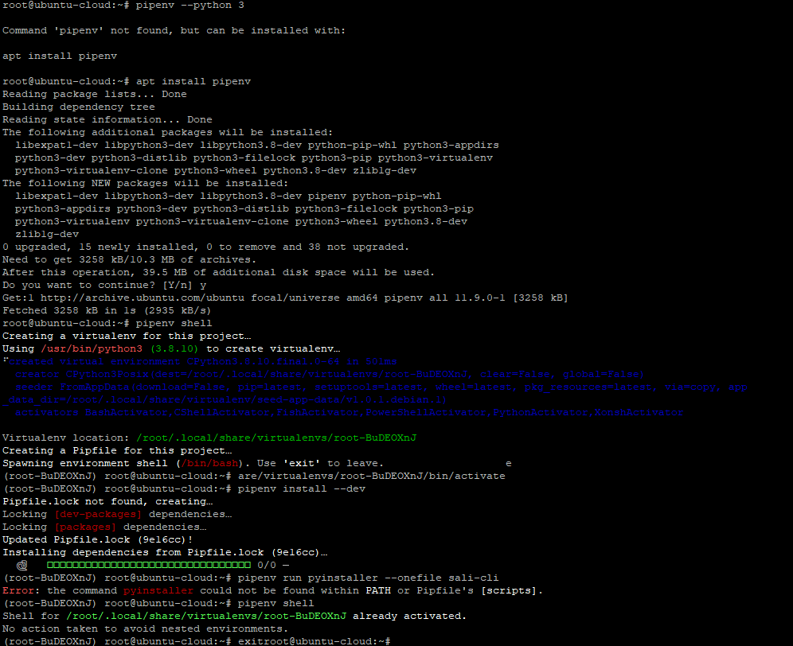
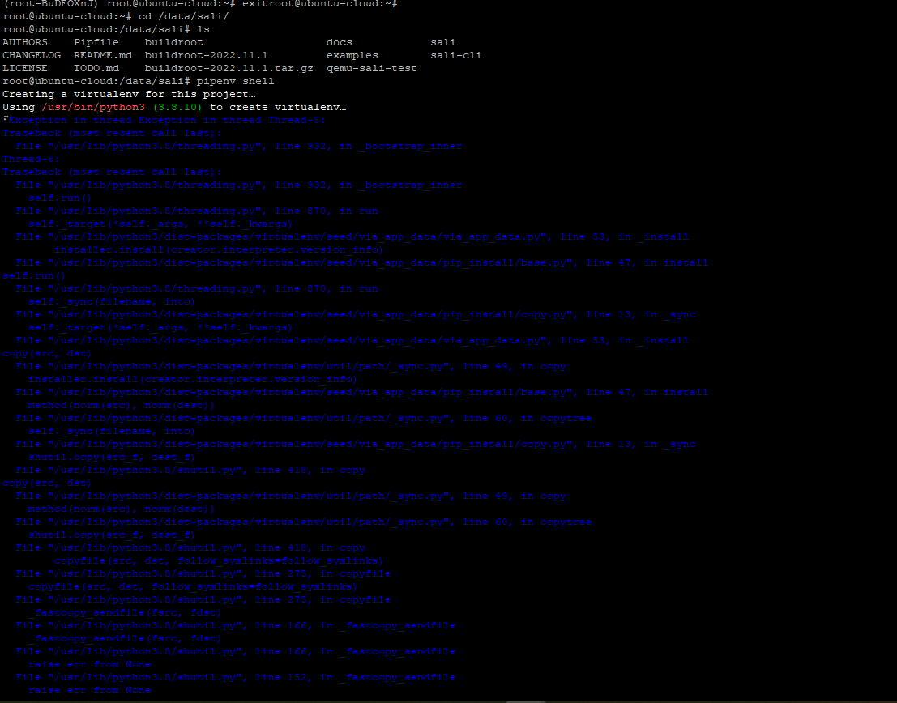
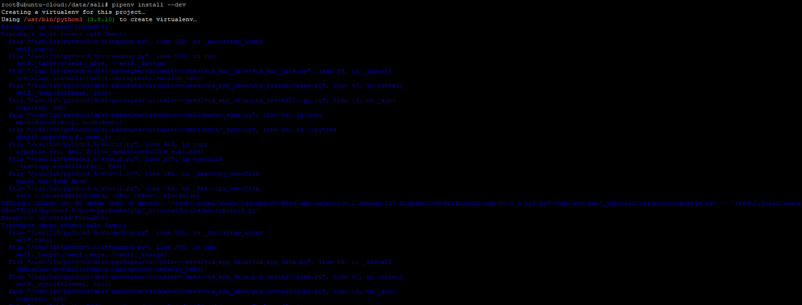
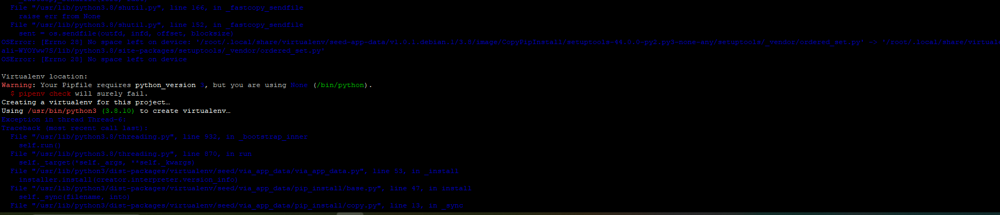
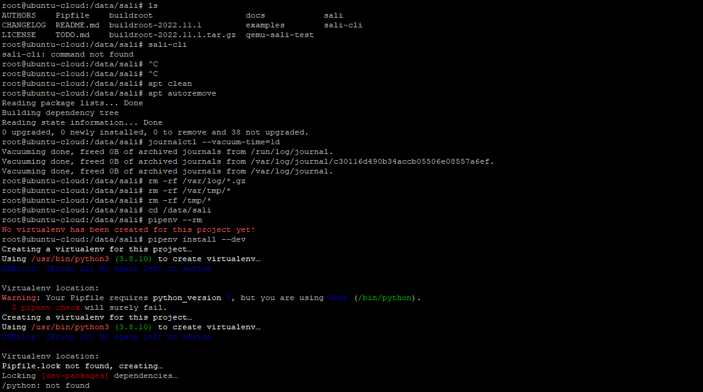
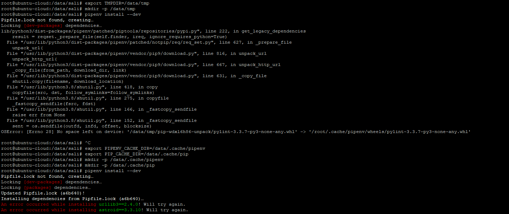
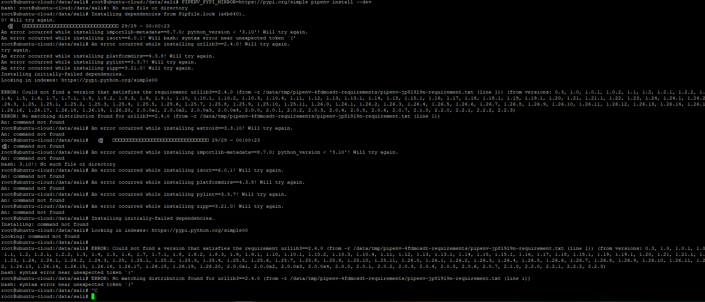

---
## Front matter
title: "Научная практика"
subtitle: "Попытка настроить sali сервере ubuntu"
author: "Хватов Максим Григорьевич"

## Generic otions
lang: ru-RU
toc-title: "Содержание"

## Bibliography
bibliography: bib/cite.bib
csl: pandoc/csl/gost-r-7-0-5-2008-numeric.csl

## Pdf output format
toc: true # Table of contents
toc-depth: 2
lof: true # List of figures
lot: false # List of tables
fontsize: 12pt
linestretch: 1.5
papersize: a4
documentclass: scrreprt
## I18n polyglossia
polyglossia-lang:
  name: russian
  options:
	- spelling=modern
	- babelshorthands=true
polyglossia-otherlangs:
  name: english
## I18n babel
babel-lang: russian
babel-otherlangs: english
## Fonts
mainfont: PT Serif
romanfont: PT Serif
sansfont: PT Sans
monofont: PT Mono
mainfontoptions: Ligatures=TeX
romanfontoptions: Ligatures=TeX
sansfontoptions: Ligatures=TeX,Scale=MatchLowercase
monofontoptions: Scale=MatchLowercase,Scale=0.9
## Biblatex
biblatex: true
biblio-style: "gost-numeric"
biblatexoptions:
  - parentracker=true
  - backend=biber
  - hyperref=auto
  - language=auto
  - autolang=other*
  - citestyle=gost-numeric
## Pandoc-crossref LaTeX customization
figureTitle: "Рис."
tableTitle: "Таблица"
listingTitle: "Листинг"
lofTitle: "Список иллюстраций"
lotTitle: "Список таблиц"
lolTitle: "Листинги"
## Misc options
indent: true
header-includes:
  - \usepackage{indentfirst}
  - \usepackage{float} # keep figures where there are in the text
  - \floatplacement{figure}{H} # keep figures where there are in the text
---

# Цель работы

Настроить sali согласно документации на gitlab

# Выполнение работы

После решения проблемы с нехватком места, ярешил храить все файлы в /data на /dev/sdb1. Создал для этого специальную папку 

```bash
cd /data
mkdir my_project
mkdir sali
cd my_project
```

Врменно указал использовать /data как кэш для apt

```bash
echo 'Dir::Cache "/data/apt-cache";' | sudo tee /etc/apt/apt.conf.d/99altcache
```

После этого установил необходимые пакеты через TMPDIR из-за нехватки места на основном разделе

```bash
TMPDIR=/data sudo growpart /dev/sda 1
TMPDIR=/data sudo apt install qemu python3-pip
```

Сделаk символическую ссылку на /var/cache/apt/archives

```bash
sudo mkdir -p /data/apt-archives
sudo mv /var/cache/apt/archives/* /data/apt-archives/
sudo rm -rf /var/cache/apt/archives
sudo ln -s /data/apt-archives /var/cache/apt/archives
```

{width=70%}

Далее я произвел попытку установить sali-cli, в следвтивии чего возникла ошибка о несуществовании gcc. Пришлось скачивать еще дополнительный gfrtn build-essential.

1. Использую apt с кэшем и временными файлами на /data

```bash
sudo mkdir -p /data/apt-tmp
sudo mkdir -p /data/apt-cache
```

2. Установи gcc и другие сборочные инструменты с перемещённым кэшем

```bash
sudo apt -o Dir::Cache::Archives="/data/apt-cache" \
         -o Dir::Cache="/data/apt-tmp" \
         install build-essential -y
```

После этого пытаюсь запустить команду


```bash
make BR2_EXTERNAL=/data/sali/buildroot sali_x86_64_defconfig
make
```

В результате чего получаю несколько ошибок в том числе и ошибку, связанную с отсутствием gcc. Исправив её окончательно, я устанавливаю pipenv и среду разработки как сказано в документации в разделе для сервера sali

{width=70%}

Перейдя непосредственно в папку /data/sali, я выполнил команду pipenv shell повторно и получил ошибку и следующий лог:

{width=70%}

{width=70%}

Попрбовал выполнить команду pip install --dev и получил точно такой же лог с ошибками. 

{width=70%}

{width=70%}

Далее попробовал использовать команду sali-cli, файл которой уже лежит в папке /data/sali со скачаными исходниками, но вышла ошибка, что команда не найдена. Начал чистить кэш, чтобы поппытаться решить предыдущие проблемы

{width=70%}

Пробую создать виртуальное окружение в виде папки .venv прямо внутри каталога /data/sali.

```bash
export PIPENV_VENV_IN_PROJECT=1
pipenv install --dev
```

перенаправляю кэш pipenv и pip на /data

1. Указываю директорию кэша для pipenv:

```bash
export PIPENV_CACHE_DIR=/data/.cache/pipenv
```

2. Указываю директорию кэша для pip:

```bash
export PIP_CACHE_DIR=/data/.cache/pip
```

3. Повторно пробую запустить команду pipenv install --dev

{width=70%}

Ошибка была в ссылке на репозиторий pip, я исправил эту ссылку, но в итоге всё равно получил много ошибок, с которыми уже не знаю, что делать.

{width=70%}