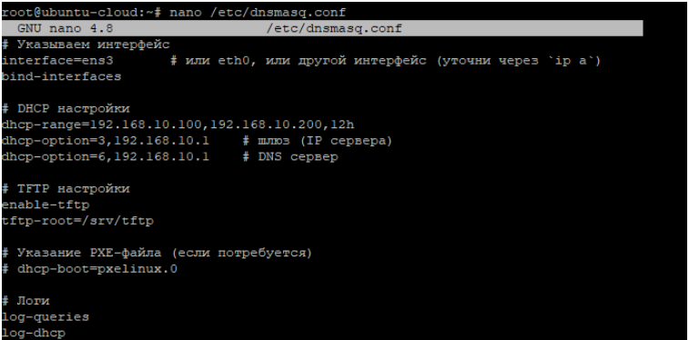
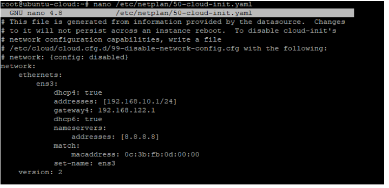
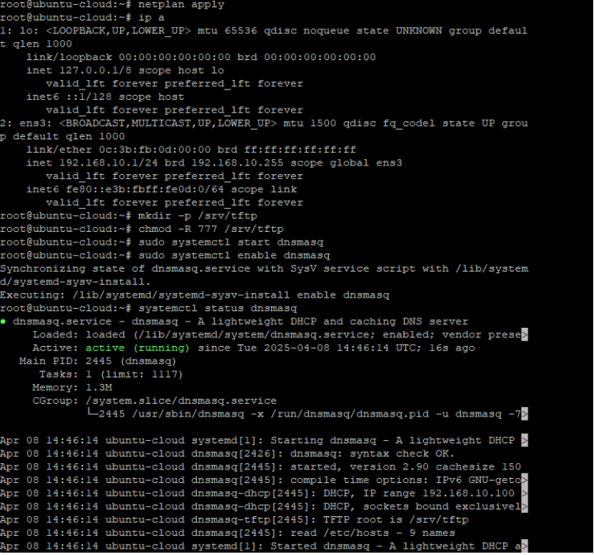
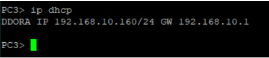

---
## Front matter
title: "Научная практика"
subtitle: "Установка интрнет-соединения с NAT через маршрутизатор"
author: "Хватов Максим Григорьевич"

## Generic otions
lang: ru-RU
toc-title: "Содержание"

## Bibliography
bibliography: bib/cite.bib
csl: pandoc/csl/gost-r-7-0-5-2008-numeric.csl

## Pdf output format
toc: true # Table of contents
toc-depth: 2
lof: true # List of figures
lot: false # List of tables
fontsize: 12pt
linestretch: 1.5
papersize: a4
documentclass: scrreprt
## I18n polyglossia
polyglossia-lang:
  name: russian
  options:
	- spelling=modern
	- babelshorthands=true
polyglossia-otherlangs:
  name: english
## I18n babel
babel-lang: russian
babel-otherlangs: english
## Fonts
mainfont: PT Serif
romanfont: PT Serif
sansfont: PT Sans
monofont: PT Mono
mainfontoptions: Ligatures=TeX
romanfontoptions: Ligatures=TeX
sansfontoptions: Ligatures=TeX,Scale=MatchLowercase
monofontoptions: Scale=MatchLowercase,Scale=0.9
## Biblatex
biblatex: true
biblio-style: "gost-numeric"
biblatexoptions:
  - parentracker=true
  - backend=biber
  - hyperref=auto
  - language=auto
  - autolang=other*
  - citestyle=gost-numeric
## Pandoc-crossref LaTeX customization
figureTitle: "Рис."
tableTitle: "Таблица"
listingTitle: "Листинг"
lofTitle: "Список иллюстраций"
lotTitle: "Список таблиц"
lolTitle: "Листинги"
## Misc options
indent: true
header-includes:
  - \usepackage{indentfirst}
  - \usepackage{float} # keep figures where there are in the text
  - \floatplacement{figure}{H} # keep figures where there are in the text
---

# Цель работы

Установить соединение с NAT для получения доступа в интрнет

# Выполнение работы

Здесь я установил следующие интерфейсы: 

- eth0 — 192.168.10.124/24 — (внутренняя сеть, клиенты)

- eth1 — 192.168.122.10/24 — (в сторону NAT)

{#fig:001 width=70%}

Далее пробую пропинговать адрес NAT 192.168.122.1, которое прошло успешно

{#fig:004 width=70%}

Проверил маршрут по умолчанию

{#fig:003 width=70%}

Проверка NAT-правила

{width=70%}

Теперь я проверил маршрут на сервере, пропинговал адрес NAT (рис. [-@fig:005]) и 8.8.8.8 (рис. [-@fig:006]).

Информация об IP на сервере:

{#fig:007 width=70%}

{#fig:005 width=70%}

{#fig:006 width=70%}

Дописал в файл resolved.conf 

```
DNS=8.8.8.8
FallbackDNS=1.1.1.1
```

{#fig:008 width=70%}

{#fig:009 width=70%}

Далее я попробовал удалить лишний маршрут, прописал правильный и сохранил изменения, далее пропинговал через traceroute 8.8.8.8

{#fig:010 width=70%}

При это до 192.168.122.1 (NAT) достучаться получается. 

Далее я попробовал использовать следующущю конфигурацию:

{#fig:011 width=70%}

Дальше я протестировал tftp, создав файл testfile.txt в директории /srv/tftp/
На другой машине из этой же сети получил его, скачав предварительно соответствующий пакет

{#fig:012 width=70%}

Дальше я установил sali, скачав пакет с gitlab.

{#fig:013 width=70%}

# Выводы

В результате проделанной работы я получил доступ в интрнет, а также склонировал на сервер пакет sali из gitlab.